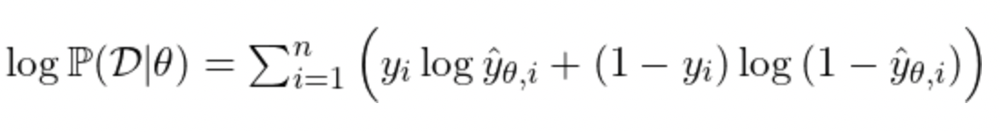
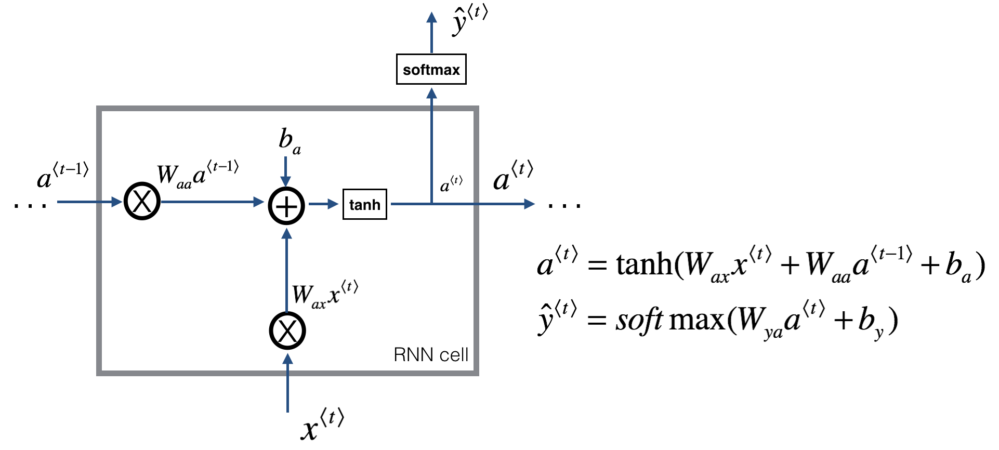

# AI Tech Interview for NLP

## [Natural Language Processing]

---

### Skip-gram 의 목적 함수에 대해서 설명해주세요.

- Skip-gram model 은 NNLM 모델을 개선한 것으로,  어떤 단어의 표현은 그 주변의 단어들에 의해서 표현된다는 가설 아래,  주변 단어들을 예측하는 목적 함수로 word vector reperesentation을 학습하는 알고리즘입니다.
- Skip-gram의 목적함수는 기본적으로 cross-entropy 를 사용합니다. 계산비용이 큰 소프트맥스 대신에 네거티브 샘플링을 통해 binary cross entropy를 하여 가까운 단어-먼 단어벡터를 학습합니다.



### (꼬리)→ Noise Contrastive Estimation이 무엇인가요?

- 직관 : 좋은 생성 모델은 데이터와 노이즈를 구분할 수 있어야한다는 것.
- NCE를 통해 unsupervised를 supervised learning으로 바꿀 수 있습니다.
    - p(x)를 추정하는 것에 대한 문제는 binary classification 을 통해 확률을 배우는 것으로 풀이할 수 있다.
    - 이를 통해 maximum likelihood를 학습합니다.

참조 : [https://cedar.buffalo.edu/~srihari/CSE676/18.6 Noise Contrastive Estimation.pdf](https://cedar.buffalo.edu/~srihari/CSE676/18.6%20Noise%20Contrastive%20Estimation.pdf)

### Transformer의 구조에 대해서 설명해주세요, RNN과의 차별점은 무엇인가요?

1) **Transformer의 구조에 대해서 설명**해주세요.

- Transformer는 Encoder-Decoder로 이루어져있습니다.
- 각 아키텍처는 self-attention 그리고 point-wise fully connected layer들이 쌓여진 상태로 구성되어있다. 각 레이어마다, 6개의 독립적인 레이어들이 쌓여서 구성되어있고, 레이어는 2개의 서브 레이어들로 구성되어있다.
- 두 서브레이어 사이에는 residual connection을 적용하여 LayerNorm(x+Sublayer(x)) 형태로 구성되어 있습니다.

2) **RNN과의 차별점**은 무엇인가요?

- 먼저, 레이어마다 시간복잡도, sequential 정보를 얻기 위해 최소 계산해야하는 수에 차이가 납니다.
- Recurrent 모델의 경우 시퀀셜한 학습 예제들의 병렬적 계산이 어렵다. 그 이유는 구조가 $h_t$를 만들기 위해서 $h_{t-1}$를 입력으로 받아 계산하기 때문이다 (추가자료를 통해 확인).
- 이 때문에, 긴 시퀀스에 대해서 메모리에 제한이 있을 수밖에 없고, 이를 위해 여러 트릭들(e.g, factorization, conditional computation)을 사용하지만 한계가 있다.
- Attention 메커니즘은 input-output간 global dependency에 대해, 병렬화를 통해 해결했다.

- **추가 자료**
    
    
    

**[출처]**

1)이미지 출처 : [https://datascience-enthusiast.com/DL/Building_a_Recurrent_Neural_Network-Step_by_Step_v1.html](https://datascience-enthusiast.com/DL/Building_a_Recurrent_Neural_Network-Step_by_Step_v1.html)

2)이미지 출처: [https://arxiv.org/pdf/1909.09595.pdf](https://arxiv.org/pdf/1909.09595.pdf)

### Transformer encoder와 decoder의 차이가 무엇인가요?

[The Illustrated GPT-2 (Visualizing Transformer Language Models)](https://jalammar.github.io/illustrated-gpt2/)

### [Natural Language Understanding]

- **ALBERT에서 제안한 방법론과 그 효과**에 대해서 설명해주세요.
    - 다음 아래와 같이 vocab size의 임베딩을 쪼개는 factorization 방법, 트랜스 포머의 레이어들 간 학습을 공유하도록 하는 쉐어링 방식, 문장의 순서를 바꿔 맞추도록 하는 Sentence ordering prediction 작업을 제안하였습니다.
    - 위 두가지 기법은 모델 파라미터 사이즈를 줄였고, 더 작은 사이즈의 모델에서 BERT 수준의 성능을 보여줍니다. NSP를 SOP와 비교하였을 때, SQuAD, NLI 작업과 같이 추론 및 의미 태스크에서 더 좋은 성능을 보였습니다.
- **추가 설명**
    - Factorized Embedding Parameterization
        - Embedding parameters (VxH)의 크기를 더 작은 매트릭스들로 쪼개는 방식.
        - O(VxE + ExH)  H >>E.
    - Code
        
        ```python
        class Embeddings(nn.Module):
            "The embedding module from word, position and token_type embeddings."
            def __init__(self, cfg):
                super().__init__()
        
                # factorized embedding
                self.tok_embed1 = nn.Embedding(cfg.vocab_size, cfg.embedding)
                self.tok_embed2 = nn.Linear(cfg.embedding, cfg.hidden)
        
                self.pos_embed = nn.Embedding(cfg.max_len, cfg.hidden) # position embedding
                self.seg_embed = nn.Embedding(cfg.n_segments, cfg.hidden) # segment(token type) embedding
        
                self.norm = LayerNorm(cfg)
                # self.drop = nn.Dropout(cfg.p_drop_hidden)
        
            def forward(self, x, seg):
                seq_len = x.size(1)
                pos = torch.arange(seq_len, dtype=torch.long, device=x.device)
                pos = pos.unsqueeze(0).expand_as(x) # (S,) -> (B, S)
        
                # factorized embedding
                e = self.tok_embed1(x)
                e = self.tok_embed2(e)
                e = e + self.pos_embed(pos) + self.seg_embed(seg)
                return self.norm(e)
        ```
        
    - Cross Layer Parameter Sharing
        - 모든 레이어들 간, 파라미터를 공유하는 방식을 말합니다.
    - Code
        
        ```python
        # Simple implementation in PyTorch
        
        class AttenBlock(nn.Module):
        	def __init__(self):
            super().__init__()
        		self.attn = MultiheadAttention() # attention block.
        		self.ffn = FeedForward()
        		self.act = nn.GeLU()		
        
        	def forward(self,x):
            self.attn(x)
        		...
        
        class Encoder(nn.Module):
        	""" Original encoder block """
        	def __init__(self):
        		super().__init__()
        		self.encoder = nn.ModuleList([AttenBlock() for _ in range(N)])
        
        	def forward(self,x):
        		for layer in self.encoder:
        			self.layer(x) # N different layers
        			...
        
        class Encoder(nn.Module):
        	""" Shared encoder block """
          def __init__(self):
        		super().__init__()
        		self.encoder = AttenBlock()
        	
        	def forward(self,x):
        		for _ in range(N): # same layers - when backpropagation, same weight updated.
        			self.encoder(x)
        
        ```
        
    - Sentence Ordering Prediction(SOP)
        - SOP vs NSP
        - [CLS] segment1 [SEP] segment2 [SEP]
            - isNEXT True or False , 예측하는 태스크. 이를 위해서 기존 랜덤으로 다음 문장을 바꾸는 것과 달리 순서를 바꿔 구분하도록 하여 SQuAD, NLI, RACE에서 약 0.6~2% 더 좋은 성능을 냄.
        - NSP는 downstream task들에서 NLI를 잘 하기 위해서 만들어진 태스크로 추론 및 문장들 간의 관계를 다루는 task들에 성능을 향상시키기 위해 학습되나, 이전 연구들에 의해 효과가 크지 않음이 밝혀짐.

- **RoBERTa에서 제안한 방법론과 그 효과에 대해서 설명해주세요.**
    - BERT에서 제안되었던 1) MLM training objectives를 개선한 dynamic masking 을 제안하였으며, NSP 유무와 sentence pair를 비교 실험하였습니다.
    
    - Dynamic masking이 무엇인가요?
        - MLM 테크닉에서 마스킹을 동적으로 Static : Every epoch 마다 static한 masking 사용.
        - Epoch 마다 mask의 pattern을 generation하며, 40epochs에서 10번 정도를 진행함.
        - 코퍼스 크기기 클 수록, 더 많은 스텝을 학습할 수록 강력.
    
    - [Refering code](https://github.com/huggingface/transformers/blob/cab7799f7b9ca7fade2265da701dac3f4f394367/src/transformers/data/data_collator.py)
        
        
    - FULL-SENTENCES without NSP
        - 4가지 조합을 실험함.

| SentencePair+NSP | Same BERT |
| --- | --- |
| SentencePair+NSP |  |
| Full Sentences | No NSP, ONLY full sentences |
| Doc Sentences | No NSP, ONLY full sentences
(Not contain cross document boundary) |

### [Natural Language Generation]

### Tokenization 방법들에 대해서 설명해주세요.

- Byte Pair Encoding 방식과 Word piece 방식의 차이를 설명해주세요.

### Autoregressive한 language model이란 무엇인가요?

- (준비중)

### Generation을 위한 Decoding methods를 말씀해주세요.

- (준비중)

참고 자료 : [https://github.com/huggingface/tokenizers/tree/102dfe87a3bf590dcb888f4f4644ad32def8c464/bindings/python/py_src/tokenizers/implementations](https://github.com/huggingface/tokenizers/tree/102dfe87a3bf590dcb888f4f4644ad32def8c464/bindings/python/py_src/tokenizers/implementations)

### BART vs GPT-2를 비교해주세요.

- (준비중)

참고 : [https://arxiv.org/pdf/1910.13461.pdf](https://arxiv.org/pdf/1910.13461.pdf)
